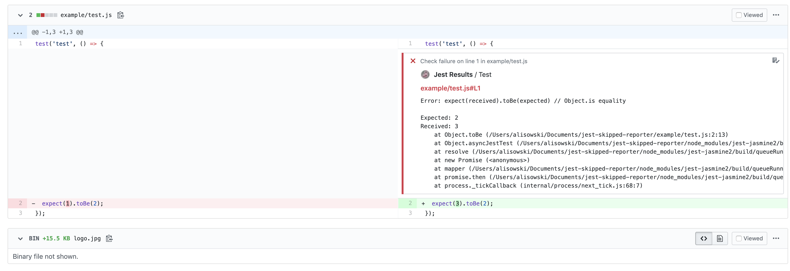

<div align="center">
  
  <h1>jest-github-reporter</h1>
  <p>See jest test errors directly in pull requests</p>
</div>

## Highlights

- Report your jest results as annotations using the [GitHub Checks API](https://developer.github.com/v3/checks/)
- Only runs in CI environment



## Install

```sh
npm install --save-dev jest-github-reporter
# or
yarn add -D jest-github-reporter
```

## Usage

You will need to install [the github app](https://github.com/apps/jest-results) to your repo.

Then just use the reporter and run jest with the `--testLocationInResults` flag and it will test errors PRs!

```json
{
   "reporters": [
     "default",
      "./dist/index.js"
  ]
}
```

```sh
jest --testLocationInResults file.js
```

## Using you own GitHub App

You might not want to use our github app for the formatter.

Reasons:

1. You think they way we exposed the keys is bad
2. You are on Github Enterprise and cannot use the public app

In these situations all you need to do is create a GitHub app and set a few environment variables.

### 1. Create a GitHub app

Go to [this page](https://github.com/settings/apps) to create a new GitHub app. You need to set the following fields:

- `name` - The name that shows for your app in the checks reports
- `Homepage URL` - You can set this to anything. Ours is set to `https://github.com`
- `Webhook URL` - You can set this to anything. Ours is set to `https://github.com`

Then hit `Save Changes` and you're all done setting up your GitHub app.

### 2. Set `JEST_APP_ID` environment variable

Your GitHub application's ID. This can be found at the top of your GitHub app's edit page.

### 3. Set `JEST_PRIVATE_KEY` environment variable

The private RSA key for your application. The prompt to generate the RSA key is at the bottom of your GitHub app's edit page.

Once you have generated a key, open the file that is downloaded and copy to text into the `PRIVATE_KEY` environment variable.
